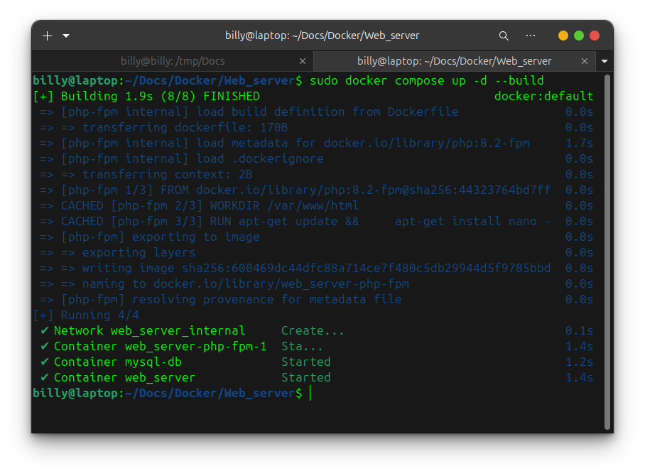
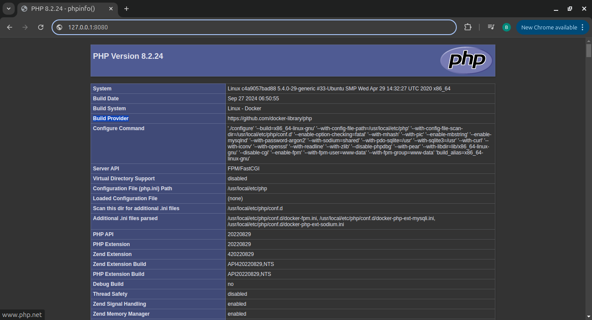

# Creating an NGINX Web Server With Docker

#### 1. Install Docker

```bash
sudo apt update
sudo apt install curl apt-transport-https ca-certificates software-properties-common
curl -fsSL https://download.docker.com/linux/ubuntu/gpg | sudo apt-key add -
sudo add-apt-repository "deb [arch=amd64] https://download.docker.com/linux/ubuntu focal stable"
sudo apt update
apt-cache policy docker-ce
sudo apt install docker-ce

```

Check your installation with the command:

```bash
sudo systemctl status docker
```


#### 2. Clone This Repository

```bash
git clone https://github.com/0xbillyyy/Docs
```


#### 3. Move To Folder

```bash
cd [Your_PATH]/Docs/Docker/Web_server/
```


#### 4. Structure Directory

```
Docker/
└── Web_server/
    ├── src/ (This is where your script is located)
    ├── Dockerfile (Here your docker build location is in the configuration)
    ├── default.conf (This is where the nginx configuration is located)
    ├── docker-compose.yml (Here your docker build location is in the configuration)
    └── README.md
```

#### 5.  Configuration `docker-compose.yml`

In the folder here edit docker-compose.yml as desired

```bash
services:
  web:
    container_name: web_server 
    image: nginx:latest
    ports:
      - '8081:80' (Port from server 8080 to docker 80, you can modify the port from)
    networks:
      - internal
    volumes:
      - ./src:/var/www/html
      - ./default.conf:/etc/nginx/conf.d/default.conf
```

#### 6. Up and build docker

```bash
docker-compose up -d --build
```



---

## 7. How to access

Access your service at browser [Your IP/HOST]:[Port From Docker]

example: `127.0.0.1:8080`


